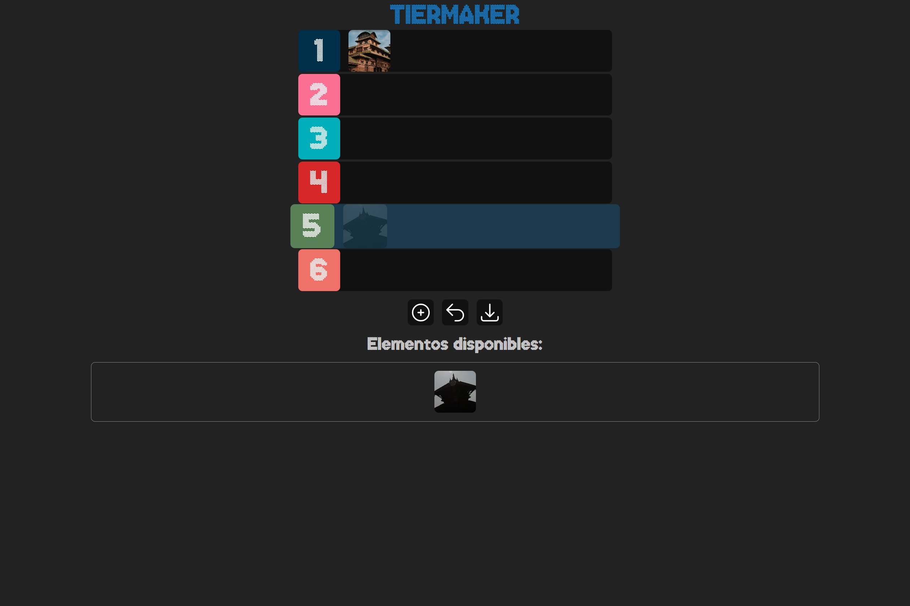

# Tier Maker

Tier Maker construido en javascript puro, con ayuda de @midudev.

Características:
- Carga de imagenes
- Uso de Drag and Drop API de JavaScript
- Descarga de tier con html2canvas

Resultado:
